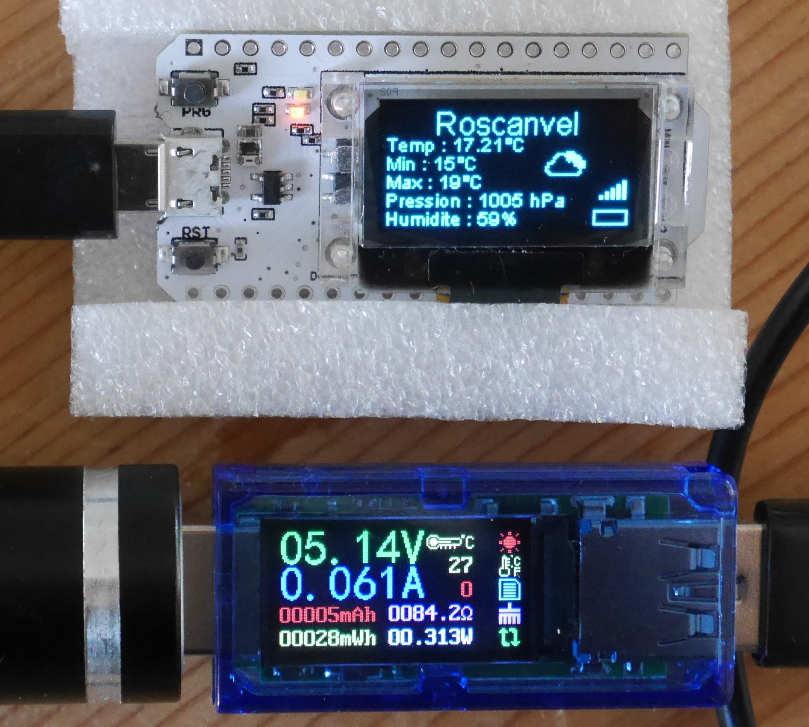

# OpenWeatherMap-WIFI-KIT-32
Utilisation de l'API REST OWM sur un ESP32 équipé d'un écran OLED de 0,96 pouce (Heltec WIFI KIT 32)
https://youtu.be/elu4MmB6_aU


# Intégration
Etude de l'intégration de l'API d'OWM sur l'ESP32 d'Heltec équipé d'un écran OLED de 0,96 pouces.

# Librairies
```
#include <ArduinoJson.h>
#include <WiFi.h>
#include <HTTPClient.h>
#include "images.h"
#include "heltec.h"
```
Utilisation de la librairie ArduinoJson version 6.x

# Configuration
```
const char* ssid = "......";  // SSID du Wifi
const char* password =  "......"; // Mot de passe du Wifi
 
const String endpoint = "https://api.openweathermap.org/data/2.5/weather?q=......,..&units=metric&lang=fr&appid="; // URL vers l'API OWM
const String key = "......"; // Cle API de OWM
```
dans le setup()
Choix de connexion Wifi (Identifiants dans le code ou WPS)
```
//wifiConnect(); // Choisir wifiConnect() pour une connexion Wifi avec les identifiants
wifiConnectWPS(); // Choisir wifiConnectWPS() pour une connexion Wifi en WPS
```

# A faire
Gestion de la batterie


# Consommation

L'intensité demandée est de 60mA environ en fonctionnement normal.

Lors de transferts de données via Wifi (toutes les 30 secondes) la consommation est de 135mA environ.

En veille "Light sleep" la consommation descend à 11mA. ( https://www.youtube.com/watch?v=TE8BYvdfDUc)


